# 📊 Análise de Reaproveitamento & Gap Analysis (Code Reuse)
**Produto**: ImpactPay AI — Central de Contas a Pagar com IA  
**Organização**: Holding Companhia de Impacto  
**Candidato**: Moisés Branco dos Santos  
**Data**: 14/09/2026  
**Status**: Homologado  

---

## 1. Contexto & Objetivo da Análise

O objetivo deste documento é realizar o diagnóstico de portabilidade, reaproveitamento de código e gap analysis entre **dois sistemas previamente construídos por Moisés Branco** e as exigências do **Desafio Técnico da Companhia de Impacto** (estruturado no nosso [PRD](file:///d:/Etna/Projetos/DesafioIHF/docs/prd-automacao-contas-a-pagar.md) e no [Guia do Desafio](file:///d:/Etna/Projetos/DesafioIHF/docs/guia-desafio-tecnico.md)).

Os dois sistemas analisados são:
1. [**App 1 — Bananecos-Auth**](file:///d:/Etna/Projetos/bananecos-workspace/apps/bananecos-auth): Módulo de Gestão de Prestadores PJ, Fechamento de Folha, Auditoria Financeira e Repasse Contábil.
2. [**App 2 — BM Scan**](file:///d:/Etna/Projetos/Magaldi/bm-scan): Módulo de Leitura de Documentos Financeiros com IA Multimodal, Orquestração n8n e Conferência *Human-in-the-Loop*.

---

## 2. Raio-X dos Aplicativos Compartilhados

### 🏢 2.1. App 1: Bananecos-Auth (Retaguarda Financeira & Governança)

* **Stack**: Next.js 16 (App Router), TypeScript 5, Tailwind CSS v4, Neon Postgres + Drizzle ORM, JSZip, Clerk Auth.
* **Proposta de Valor**: Plataforma completa de contas a pagar para empresas com prestadores PJ, cobrindo da entrega de escopo ao pagamento e fechamento contábil.

#### O que é o "Ouro" deste App:
1. **Máquina de Estados de 7 Fases**:
   - `AGUARDANDO_NF` $\rightarrow$ `EM_ANALISE` $\rightarrow$ `RECUSADO` / `PRONTO_PARA_PIX` $\rightarrow$ `PAGO` (com anexo obrigatório de comprovante) $\rightarrow$ `INADIMPLENTE`.
   - Modela com precisão o ciclo de contas a pagar exigido pela holding.
2. **Engenharia Financeira & Governança**:
   - **Centavos Inteiros (`integer`)**: Elimina qualquer erro de ponto flutuante em somas de retenções e impostos.
   - **Trava de Auto-Auditoria**: Gestores PJ não podem aprovar as próprias despesas/notas (regra inegociável de compliance).
3. **Módulo do Contador (`/contador/acesso` + Download em .ZIP)**:
   - Link mágico temporário seguro com expiração (3 a 30 dias).
   - Rota `/api/contador/download` que agrupa todos os PDFs e XMLs do mês em memória via `JSZip` e gera um pacote único organizado.
4. **Tratamento de Recusa com Justificativa**:
   - Modal obrigatório no admin para detalhar motivo de reprovação e devolução com 1 clique para substituição pelo prestador.

#### Parecer Técnico de Aproveitamento:
* ✅ **Aproveitar Diretamente**: Máquina de estados, regras de precisão financeira, lógica do módulo do contador e matriz de motivos de recusa.
* ❌ **Descartar/Isolar**: Autenticação Clerk (o desafio requer acesso público/demo), módulo de políticas de reembolso e controle de férias/recessos.

---

### 👁️ 2.2. App 2: BM Scan (Inteligência Artificial & Human-in-the-Loop)

* **Stack**: React 18 + Vite, Tailwind CSS, shadcn/ui + Radix UI, n8n, OpenAI GPT-4o Vision, Neon Postgres (PL/pgSQL).
* **Proposta de Valor**: Leitura inteligente de boletos e balancetes condominiais via IA multimodal com tela de conferência assistida antes da persistência definitiva.

#### O que é o "Ouro" deste App:
1. **Workflow n8n de Ponta a Ponta (`Processar Boletos.json`)**:
   - Nó Webhook (`multipart/form-data`) que recebe arquivos binários.
   - Nó LangChain / OpenAI GPT-4o Vision com extração multimodal em Base64.
   - Nó JavaScript de sanitização e validação de schema JSON (remoção de backticks e tipagem).
2. **Estratégia de Prompt com *"Strict Null"* (Anti-Alucinação)**:
   - Diretriz explícita instruindo a IA a retornar `null` caso um dado não esteja legível ou explícito. Zero risco de inventar valores fiscais.
3. **Componente de Conferência Assistida (`BoletoReviewForm.tsx`)**:
   - **Feedback cromático**: Campos lidos com sucesso em verde; campos nulos ou incertos em amarelo pulsante (`animate-pulse-soft`).
   - **Dicas contextuais (`FIELD_HINTS`)**: Instruções visuais que mostram onde localizar o campo no papel.
   - **Edição inline**: O operador confere, ajusta e confirma com 1 clique.
4. **Idempotência no Banco de Dados (`01_criar_funcao_neon.sql`)**:
   - Função PL/pgSQL com `INSERT ... ON CONFLICT DO UPDATE` (ou `DO NOTHING`) impedindo duplicidade no Postgres.

#### Parecer Técnico de Aproveitamento:
* ✅ **Aproveitar Diretamente**: O arquivo de workflow do n8n (esqueleto e nós), a diretriz de prompt anti-alucinação, os componentes de UI de conferência (`ReviewForm`) e a idempotência SQL.
* 🔄 **Adaptar**: Substituir o schema de condomínio pelo schema de Nota Fiscal de Serviços (NFS-e/NF-e).

---

## 3. A Fusão Arquitetural: BM Scan (Frente) + Bananecos (Retaguarda)

A união dos dois códigos resolve 100% da arquitetura do desafio:

```mermaid
flowchart LR
    subgraph PONTA_IA["BM Scan (Ingestão & IA)"]
        A["Upload NF (PDF/Img)"] --> B["n8n + GPT-4o Vision"]
        B --> C["Strict Null Prompt"]
        C --> D["Review Form (Human-in-the-Loop)"]
    end

    subgraph RETAGUARDA["Bananecos (Governança Financeira)"]
        D -->|Dados Confirmados| E[("Neon Postgres: ON CONFLICT")]
        E --> F["Máquina de Estados (7 Fases)"]
        F --> G["Trava de Auto-Auditoria & Alçadas"]
        G --> H["Baixa com Comprovante Pix"]
        H --> I["Download do Lote (.ZIP Contábil)"]
    end

    style B fill:#e1f5fe,stroke:#0288d1,stroke-width:2px
    style D fill:#fff9c4,stroke:#fbc02d,stroke-width:2px
    style F fill:#f3e5f5,stroke:#7b1fa2,stroke-width:2px
    style I fill:#e8f5e9,stroke:#388e3c,stroke-width:2px
```

---

## 4. Gap Analysis Detalhado: "O Que Já Temos" vs. "O Que Falta Fazer do Zero"

Cotejando os requisitos do [PRD do ImpactPay AI](file:///d:/Etna/Projetos/DesafioIHF/docs/prd-automacao-contas-a-pagar.md) e os 4 Entregáveis Oficiais do desafio:

### 🟢 4.1. O Que Já Temos (Reaproveitamento Quase Direto de Código)

| Requisito / Componente | Onde está no código compartilhado | Esforço Restante |
|---|---|---|
| **Pipeline n8n de Ingestão e Visão** | `Processar Boletos.json` (BM Scan) | **10%** (Apenas trocar o prompt e a lista de campos para NFS-e). |
| **Sanitizador de JSON no n8n** | Nó de código JavaScript em `Processar Boletos.json` | **0%** (Pronto para copiar e colar). |
| **Prompt Anti-Alucinação (Strict Null)** | Diretrizes de sistema no n8n (BM Scan) | **5%** (Ajustar para contexto tributário brasileiro: ISS, IRRF, etc.). |
| **Tela de Conferência Human-in-the-Loop** | `ReviewPage.tsx` e `BoletoReviewForm.tsx` (BM Scan) | **15%** (Trocar os inputs para Razão Social, CNPJ, Vencimento, Valor). |
| **Máquina de Estados Financeira** | `month_closures` e enum no Drizzle (Bananecos) | **0%** (Lógica de estados e transições 100% pronta). |
| **Regra Anti-Duplicidade no Banco** | `01_criar_funcao_neon.sql` (BM Scan) | **10%** (Definir a constraint única como `[cnpj_prestador, numero_nf]`). |
| **Geração de Lote Contábil (.ZIP)** | `/api/contador/download/route.ts` (Bananecos) | **0%** (Pronto via `jszip`). |
| **Regras de Compliance Financeiro** | Trava de auto-auditoria e centavos inteiros (Bananecos) | **0%** (Conceito pronto para redação da solução). |

---

### 🟡 4.2. O Que Temos Base e Precisamos Adaptar / Customizar

| Requisito / Componente | O que já existe | O que precisamos fazer para o Desafio IHF |
|---|---|---|
| **JSON Schema Fiscal** | Schema de balancete/boleto | Modelar o JSON Schema estrito para Nota Fiscal (Prestador, Tomador, Alíquotas, Vencimento, Chave de Acesso). |
| **Roteamento por Vertical da Holding** | Vínculo prestador-empresa no Bananecos | Regra no n8n para identificar o CNPJ do Tomador e classificar se pertence a: *Impact Hub*, *Salto*, *Impacta Mais* ou *Seu PêJota*. |
| **Validação Algorítmica de CNPJ** | `validators.ts` no BM Scan | Adicionar o cálculo dos dois dígitos verificadores de CNPJ e checagem de 44 dígitos da chave de acesso. |
| **Split View (Visualizador Lado a Lado)** | Componente de formulário isolado | Colocar o visualizador de PDF (iframe/object) no lado esquerdo e os campos editáveis no lado direito da tela de revisão. |

---

### 🔴 4.3. O Que Falta Fazer do Zero (Entregáveis Específicos da Banca)

Estes são os itens que não existem nos repositórios e precisam ser produzidos exclusivamente para este processo seletivo:

1. **Os 3 a 5 PDFs Fictícios de Notas Fiscais**:
   - Precisamos gerar arquivos PDF simulados realistas de NFS-e (com dados do prestador fictício e das empresas da holding como tomadoras) para testes e para o vídeo.
2. **Entregável 1: Documento "Desenho da Solução Completa" (Até 2 Páginas A4)**:
   - Redação executiva de alto nível contendo: visão sistêmica, justificativa das ferramentas, matriz RACI, mapa de riscos e conformidade LGPD.
3. **Entregável 3: Manual Operacional do Time Financeiro**:
   - Documento didático e visual para a Persona Ana (Analista Financeira), sem jargões complexos, com o fluxo de contingência *"O que fazer se quebrar"*.
4. **Entregável 4: Roteiro e Gravação do Vídeo Demonstrativo (Até 3 Minutos)**:
   - Script segundo a segundo para demonstrar: Upload $\rightarrow$ n8n rodando $\rightarrow$ Conferência com IA $\rightarrow$ Persistência e fechamento.
5. **A Landing Page Centralizadora do Desafio (Entrega via Link Único)**:
   - Página única na Vercel reunindo: player de vídeo incorporado, diagrama com zoom, botões de download e simulador da API.

---

## 5. Estimativa de Economia de Tempo & Vantagem Competitiva

* **Tempo que levaria para fazer tudo do zero**: ~40 a 50 horas de engenharia.
* **Tempo com o reaproveitamento dos seus 2 apps**: ~**6 a 8 horas**, focadas quase exclusivamente em:
  1. Exportar e testar o `.json` do n8n com as notas fiscais.
  2. Redigir os 2 documentos oficiais (Desenho da Solução e Manual).
  3. Gravar o vídeo demonstrativo de 3 minutos.
* **Vantagem Competitiva Frente aos Outros Candidatos**: Enquanto os demais candidatos entregarão fluxos teóricos ou automações isoladas no n8n, você apresentará uma **arquitetura de produto completa**, já validada com banco de dados, governança real e experiência de conferência assistida por IA (*Human-in-the-Loop*).
