# 🧭 Entregável 1 — Desenho da Solução Completa (iHubFiscal Modelo Dual)
**Desafio Técnico**: Pessoa Analista Pleno de Inteligência Artificial e Produtos Digitais  
**Candidato**: Moisés Branco dos Santos  
**Organização**: Holding Companhia de Impacto  
**Extensão Oficial**: 2 Páginas A4 (Síntese Executiva de Arquitetura)  

---

## 📌 PÁGINA 1 — Visão Sistêmica, Arquitetura & Governança

### 1. Contexto & Diagnóstico da Holding
A **Companhia de Impacto** consolida 4 verticais de negócio com CNPJs distintos (*Impact Hub Floripa*, *Instituto Salto*, *Impacta Mais* e *Seu PêJota*). O processo anterior sofria com 3 caixas de e-mail descentralizadas, digitação manual em planilhas e aprovações informais via WhatsApp. Isso gerava perda de prazos (juros e multas), atrito com fornecedores e falta de visibilidade para a diretoria executiva.

O **iHubFiscal** implementa uma governança moderna com arquitetura dual:
* **Solução A (Google Workspace)**: Automação ágil e sem custo de infraestrutura com Gemini Spark, Gmail, Google Drive, Google Sheets (18 colunas + Dashboard) e Web App Apps Script (aprovação por link de 1 clique no e-mail).
* **Solução B (iHubFiscal Enterprise)**: Aplicação Web completa em Next.js 15, Vercel, Supabase (PostgreSQL com RLS e Storage), Google Gemini 2.5 Flash multimodal, esteira Kanban de 6 fases com alçadas hierárquicas (Gestor até R$ 10k / CFO ilimitado) e fechamento contábil .ZIP em lote.

```mermaid
flowchart LR
    subgraph INGESTAO["1. Ingestão & Autoatendimento"]
        A["Fornecedor envia NF (/upload)"] --> B["Geração de Hash SHA-256 (Anti-Duplicidade)"]
    end

    subgraph EXTRACAO_IA["2. Extração & Auditoria Fiscal"]
        B --> C["Google Gemini 2.5 Flash / Spark"]
        C --> D["Validação Matemática (Bruto - Retenções = Líquido)"]
        D --> E["Identificação da Vertical & Centro de Custo"]
    end

    subgraph WORKFLOW_ALCADAS["3. Governança & Alçadas (Kanban 6 Fases)"]
        E --> F["1. Triagem & Divergências"]
        F --> G["2. Aguardando Aprovação"]
        G --> H{"Valor <= R$ 10.000?"}
        H -- Sim --> I["Aprovação Gestora (Beatriz)"]
        H -- Não --> J["Aprovação Exclusiva CFO (Rodrigo)"]
    end

    subgraph LIQUIDACAO_CONTABIL["4. Liquidação & Fechamento"]
        I & J --> K["4. Agendar Pagamento & 5. Agendado"]
        K --> L["6. Baixa Pix & Pacote .ZIP (jszip)"]
    end

    style C fill:#e1f5fe,stroke:#0288d1,stroke-width:2px
    style D fill:#e8f5e9,stroke:#2e7d32,stroke-width:2px
    style G fill:#fff3e0,stroke:#f57c00,stroke-width:2px
    style L fill:#f3e5f5,stroke:#7b1fa2,stroke-width:2px
```



---

### 2. Stack Tecnológica Escolhida & Racional de Decisão (Modelo Dual)

| Camada | Solução A (Google Workspace) | Solução B (iHubFiscal Full-Stack) | Racional Técnico & Vantagem Estratégica |
|---|---|---|---|
| **Front-end & UX** | **Gmail, Drive & Sheets** | **Next.js 15 (App Router) + Tailwind** | Solução A aproveita ferramentas já dominadas; Solução B entrega SPA responsiva e interativa com identidade visual oficial de floripa.impacthub.net. |
| **Backend & API** | **Google Apps Script (Web App)** | **Route Handlers & Server Actions na Vercel** | Solução A não requer servidor nem manutenção; Solução B oferece rotas tipadas, validação Zod e execução serverless de alta performance. |
| **Inteligência Artificial** | **Google Gemini Spark** | **Google Gemini 2.5 Flash via API** | Alta acurácia na leitura visual de tabelas tributárias de NFS-e, velocidade inferior a 4 segundos e mitigação de alucinações via Structured Outputs. |
| **Storage & Banco** | **Google Drive & Google Sheets** | **Supabase PostgreSQL & Object Storage** | Planilha simples de 18 colunas para operações enxutas; banco relacional com RLS por tenant para blindagem jurídica multi-empresa. |
| **Alçadas & Aprovação** | **Link 1-Clique direto no e-mail (doGet)** | **Kanban 6 Fases com trava CFO (> R$ 10k)** | Aprovação sem fricção por e-mail na Solução A; segregação rigorosa de funções e alçadas corporativas na Solução B. |
| **Fechamento Fiscal** | **Planilha compartilhada com contador** | **Pacote .ZIP compilado no navegador (jszip)** | Compilação em lote no browser com PDFs renomeados (`NF_{num}_{prestador}.pdf`) e conciliação em CSV analítico. |

---

### 3. Matriz de Responsabilidades (RACI)

| Etapa do Processo | Fornecedor PJ | Carlos (Analista) | Beatriz (Gestora) | Rodrigo (CFO) | iHubFiscal IA |
|---|:---:|:---:|:---:|:---:|:---:|
| Envio do documento fiscal e pré-conferência (/upload) | **R** | I | I | I | **A** (Extrai) |
| Deduplicação (SHA-256) e checagem de retenções fiscais | I | I | I | I | **A / R** |
| Triagem de divergências cadastrais ou de impostos | I | **A / R** | C | I | I |
| Aprovação de despesas operacionais (até R$ 10.000,00) | I | I | **A / R** | I | I |
| Deliberação executiva de despesas elevadas (> R$ 10.000,00) | I | I | C | **A / R** | I |
| Agendamento bancário e baixa com comprovante Pix | I | **A / R** | I | I | I |
| Geração e exportação do lote contábil mensal (.ZIP + CSV) | I | **A** | I | I | **R** (Compila) |

*Legenda: **R** = Responsável pela Execução | **A** = Aprovador / Dono | **C** = Consultado | **I** = Informado*

---

## 📌 PÁGINA 2 — Riscos, Mitigações, LGPD & Tratamento de Falhas

### 4. Matriz de Riscos & Tratamento de Falhas ("O Que Fazer Se Quebrar")

| Risco / Ponto de Falha | Severidade | Ação Preventiva Automatizada | Procedimento de Contingência Operacional |
|---|:---:|---|---|
| **Nota fiscal borrada, cortada ou ilegível** | Média | Validação com *Strict Null* retém a nota na fase `1. Triagem & Divergências`. | O analista financeiro abre `/conferencia/[id]` com split-view, confere os dados no PDF com zoom e digita a correção. |
| **Tentativa de envio de NF duplicada** | Crítica | O hash SHA-256 e a chave única `[company_id + cnpj + numero]` bloqueiam no banco. | A interface avisa na hora: *"Nota já cadastrada sob Protocolo #IHF-XXXX"*, impedindo pagamentos duplicados no banco. |
| **Divergência matemática de retenções** | Alta | Validação algorítmica: `|Bruto - Retenções - Líquido| > 0,05`. Detecta divergências de ISS, IRRF, PIS/COFINS/CSLL. | O financeiro é notificado com alerta tributário na esteira e bloqueio do avanço até conferência das alíquotas. |
| **Gestor tenta aprovar despesa acima de R$ 10.000,00** | Crítica | Trava de alçada no servidor: se `valor > 10000`, a aprovação fica restrita à persona CFO. | O sistema emite aviso de alçada excedida e mantém a fatura na fase de aprovação aguardando parecer do CFO Rodrigo. |
| **Indisponibilidade momentânea da IA (HTTP 503)** | Média | Pool fail-fast automático: tenta `gemini-flash-latest` e faz fallback para `gemini-flash-lite-latest` (< 18s). | Caso persistir instabilidade, a interface disponibiliza banner com opção amigável de preenchimento manual contingencial. |

---

### 5. Governança Financeira & Adequação à LGPD

#### A. Trava de Auto-Auditoria (Segregação de Funções - SoD)
Nenhum gestor ou colaborador PJ pode aprovar a sua própria nota fiscal ou solicitação de reembolso. O sistema valida no backend o ID do aprovador contra o CNPJ/CPF do prestador emissor, transferindo compulsoriamente a alçada para a liderança superior caso haja coincidência.

#### B. Proteção de Dados Pessoais (LGPD - Lei 13.709/2018)
* **Dados Pessoais Sensíveis**: Notas fiscais de autônomos (RPA) e MEI contêm CPF, nome civil, endereço residencial e chave Pix/dados bancários.
* **Criptografia em Trânsito e Repouso**: Todo o tráfego ocorre sobre conexões seguras TLS 1.3 (HTTPS) e os arquivos são persistidos no Supabase Storage com chave privada.
* **Isolamento Multi-Empresa com RLS**: Políticas de Row Level Security garantem isolamento estrito por tenant, impedindo que colaboradores de uma vertical acessem notas de outra empresa da holding.
* **Auditoria Imutável em Banco**: Toda transição de fase, edição de campo e aprovação registra log perpétuo na tabela `invoice_events` com timestamp, identificador do usuário e payload anterior/novo.

---

### 6. Métricas de Sucesso do Produto (KPIs)

```
┌─────────────────────────────────────────────────────────────────────────────────┐
│  MÉTRICAS CHAVE DE SUCESSO (TARGETS DO IHUBFISCAL)                               │
│                                                                                 │
│  ⚡ Tempo Médio de Processamento:  Redução de 72h  ➔  < 4h por nota             │
│  📉 Multas e Juros por Atraso:     Eliminação de 100% dos atrasos operacionais   │
│  🎯 Acurácia da Extração via IA:   >= 98% de precisão nos campos críticos        │
│  ⏱️ Esforço Manual do Financeiro:   Redução de 90% das horas de digitação         │
└─────────────────────────────────────────────────────────────────────────────────┘
```

---

*Documento integrante do Entregável 1 do Desafio Técnico da Companhia de Impacto.*
