# 🧭 Entregável 1 — Desenho da Solução Completa (ImpactPay AI)
**Desafio Técnico**: Pessoa Analista Pleno de Inteligência Artificial e Produtos Digitais  
**Candidato**: Moisés Branco dos Santos  
**Organização**: Holding Companhia de Impacto  
**Extensão Oficial**: 2 Páginas A4 (Síntese Executiva de Arquitetura)  

---

## 📌 PÁGINA 1 — Visão Sistêmica, Arquitetura & Governança

### 1. Contexto & Diagnóstico da Holding
A **Companhia de Impacto** consolida 4 verticais de negócio (*Impact Hubs Floripa/SP/POA/Cuiabá*, *Salto*, *Impacta Mais* e *Seu PêJota*). O processo atual de contas a pagar sofre com 3 caixas de e-mail descentralizadas, digitação manual em planilhas e aprovações informais via WhatsApp. Isso resulta em perda de prazos (juros e multas), desgaste com fornecedores e falta de visibilidade da liderança sobre o fluxo de caixa.

O **ImpactPay AI** unifica a recepção, audita com IA Multimodal e estabelece um fluxo de aprovação com governança corporativa:

```mermaid
flowchart LR
    subgraph INGESTAO["1. Ingestão Centralizada"]
        A["Fornecedor envia NF (E-mail / Webhook)"] --> B["Geração de Hash SHA-256 (Anti-Duplicidade)"]
    end

    subgraph EXTRACAO_IA["2. Extração & Auditoria Fiscal"]
        B --> C["LLM Multimodal (Prompt Strict Null)"]
        C --> D["Validação Matemática (Bruto - Retenções = Líquido)"]
        D --> E["Identificação da Vertical & Centro de Custo"]
    end

    subgraph WORKFLOW_ALCADAS["3. Governança & Alçadas"]
        E --> F["Status: AGUARDANDO_APROVACAO"]
        F --> G["Card Interativo ao Gestor (Slack/Teams/Whats)"]
        G --> H{"Decisão do Gestor"}
        H -- Aprovado --> I["Status: PRONTO_PARA_PAGAMENTO"]
        H -- Recusado --> J["Notifica Fornecedor com Motivo"]
    end

    subgraph LIQUIDACAO_CONTABIL["4. Liquidação & Contabilidade"]
        I --> K["Baixa Bancária (Anexo Comprovante Pix)"]
        K --> L["Portal do Contador: Download .ZIP em Lote"]
    end

    style C fill:#e1f5fe,stroke:#0288d1,stroke-width:2px
    style D fill:#e8f5e9,stroke:#2e7d32,stroke-width:2px
    style G fill:#fff3e0,stroke:#f57c00,stroke-width:2px
    style L fill:#f3e5f5,stroke:#7b1fa2,stroke-width:2px
```



---

### 2. Stack Tecnológica Escolhida & Racional de Decisão (Modelo Dual)

| Camada | Solução A (Google Workspace) | Solução B (iHubFiscal Full-Stack) | Racional Técnico & Vantagem Estratégica |
|---|---|---|---|
| **Orquestração & Core** | **Google Apps Script & Gemini Spark** | **Next.js 15 & Vercel Serverless** | A Solução A viabiliza início imediato com custo zero; a Solução B oferece plataforma enterprise independente. |
| **Inteligência Artificial** | **Gemini Spark Multimodal** | **Google Gemini 2.5 Flash via API** | Alta acurácia na leitura visual de tabelas tributárias de NFS-e, com velocidade (< 4s) e suporte a saídas estruturadas. |
| **Estratégia de Prompt** | **Strict Null Framework** | **Zod Schema / Structured Outputs** | Eliminação completa de alucinações: campos ausentes retornam nulos e são auditados por humanos. |
| **Storage & Banco** | **Google Drive & Google Sheets** | **Supabase PostgreSQL & Object Storage** | Planilha simples para equipes enxutas; banco relacional com RLS e alçadas estritas para alta governança. |
| **Aprovações** | **Web App 1-Clique (doGet)** | **Central de Alçadas (Kanban 6 Fases)** | Aprovação sem fricção direto do e-mail (Solução A) ou governança com teto de R$ 10k e alçada de CFO (Solução B). |

---

### 3. Matriz de Responsabilidades (RACI)

| Etapa do Processo | Fornecedor PJ | Time Financeiro | Gestor da Vertical | Sistema (ImpactPay AI) |
|---|:---:|:---:|:---:|:---:|
| Envio do documento fiscal legível | **R** | I | I | A |
| Deduplicação e extração inteligente via IA | I | I | I | **A / R** |
| Triagem de divergências / exceções | I | **A / R** | C | I |
| Aprovação da despesa (Alçada de Contratação) | I | I | **A / R** | I |
| Agendamento, baixa do pagamento e Pix | I | **A / R** | I | I |
| Repasse do lote fiscal à contabilidade externa | I | **A** | I | **R** (Gera .ZIP) |

*Legenda: **R** = Responsável pela Execução | **A** = Aprovador / Dono | **C** = Consultado | **I** = Informado*

---

## 📌 PÁGINA 2 — Riscos, Mitigações, LGPD & Tratamento de Falhas

### 4. Matriz de Riscos & Tratamento de Falhas ("O Que Fazer Se Quebrar")

| Risco / Ponto de Falha | Severidade | Ação Preventiva Automatizada | Procedimento de Contingência Operacional |
|---|:---:|---|---|
| **Nota fiscal borrada ou ilegível** | Média | Prompt retorna `"confidence_score" < 0.8` e campos nulos. O pipeline move a nota para status `REVISAO_MANUAL`. | O analista financeiro visualiza o PDF em split-view, confere os dados manualmente e aprova ou solicita novo envio em 1 clique. |
| **Tentativa de envio de NF duplicada** | Crítica | O hash SHA-256 e a checagem `CNPJ + Número` barram imediatamente a nota na entrada do n8n. | O sistema envia e-mail automático ao remetente informando a data e o ID da nota já cadastrada, impedindo duplicidade. |
| **Divergência matemática de retenções** | Alta | O nó Code calcula `|Bruto - Retenções - Líquido|`. Se $> R$ 0,05$, adiciona flag de divergência fiscal. | O financeiro é notificado com o cálculo detalhado de ISS/IRRF/PIS/COFINS/CSLL para ajuste antes de aprovar. |
| **Gestor não responde à aprovação** | Alta | Disparo automático de lembrete no WhatsApp/Slack com 48h e 24h antes da data de vencimento da fatura. | Se faltarem 24h para o vencimento sem retorno, a pendência é escalonada automaticamente para o diretor da vertical. |
| **Indisponibilidade momentânea de API** | Média | Política de 3 retentativas automáticas no n8n com backoff exponencial (1 min, 5 min, 15 min). | Caso persista, os arquivos ficam enfileirados em pasta segura com disparo de alerta no canal de monitoramento. |

---

### 5. Governança Financeira & Adequação à LGPD

#### A. Trava de Auto-Auditoria (Segregação de Funções)
Nenhum gestor ou colaborador PJ pode aprovar a sua própria nota fiscal ou despesa de reembolso. O sistema valida no backend o ID do aprovador contra o CNPJ/CPF do prestador emissor, transferindo a alçada para o superior imediato caso haja coincidência.

#### B. Proteção de Dados Pessoais (LGPD - Lei 13.709/2018)
* **Dados Sensíveis de MEI / Profissionais Autônomos**: Notas de prestadores autônomos trazem CPF, endereço residencial e dados bancários/Pix. 
* **Trânsito e Armazenamento Criptografados**: Todo o tráfego ocorre sobre TLS 1.3 (HTTPS).
* **Controle de Acesso Baseado em Papéis (RBAC)**: Apenas o time financeiro e o gestor da vertical têm acesso aos dados de faturamento e chaves Pix.
* **Política de Retenção e Expiração**: O portal do contador utiliza links temporários com expiração configurada (máximo de 15 dias), evitando links públicos expostos indefinidamente.

---

### 6. Métricas de Sucesso do Produto (KPIs)

```
┌─────────────────────────────────────────────────────────────────────────────────┐
│  MÉTRICAS CHAVE DE SUCESSO (TARGETS DO IMPACTPAY AI)                             │
│                                                                                 │
│  ⚡ Tempo Médio de Processamento:  Redução de 72h  ➔  < 4h por nota             │
│  📉 Multas e Juros por Atraso:     Eliminação de 100% dos atrasos operacionais   │
│  🎯 Acurácia da Extração via IA:   >= 98% de precisão nos campos críticos        │
│  ⏱️ Esforço Manual do Financeiro:   Redução de 90% das horas de digitação         │
└─────────────────────────────────────────────────────────────────────────────────┘
```

---

*Documento integrante do Entregável 1 do Desafio Técnico da Companhia de Impacto.*
