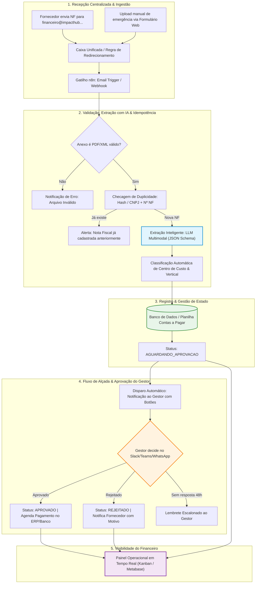

# 🧭 Guia Estruturado de Resolução: Desafio Técnico — Companhia de Impacto (Impact HUB)
**Vaga**: Pessoa Analista Pleno de Inteligência Artificial e Produtos Digitais  
**Candidato**: Moisés Branco dos Santos  
**Prazo Fatal de Envio**: **16/09/2026 às 23:59 (Horário de Brasília)**  
**Canal de Entrega**: Formulário oficial (Envio de **Link Único**)

---

## 📌 1. Visão Geral & O Texto Orientador do Desafio

### 🎯 O Propósito do Desafio
Avaliar na prática a capacidade do candidato em:
1. Pensar como **AI Product Architect & Analista de Processos** (enxergar o negócio ponta a ponta, antever falhas e proteger a operação).
2. Construir soluções práticas, modernas e enxutas (**Vibe Coding & Automações no n8n**).
3. Traduzir tecnologia complexa em documentação clara e acessível para o usuário final de negócio (o time financeiro).
4. Demonstrar domínio ético, prático e eficaz de **IA Generativa aplicada a processos reais**.

### 🏢 Contexto da Organização (Holding Companhia de Impacto)
A **Companhia de Impacto** é o primeiro grupo de negócios 100% dedicado ao impacto socioambiental no Brasil. A holding reúne 4 verticais de negócio:
- **Impact Hubs** (Rede em Florianópolis, São Paulo, Porto Alegre e Cuiabá)
- **Salto** (Especialista em inclusão produtiva)
- **Impacta Mais** (Eventos e congressos de impacto)
- **Seu PêJota** (Soluções corporativas e empreendedorismo)

*Como holding, sua missão primordial é garantir governança, eficiência operacional, sustentabilidade e segurança jurídica a todas as empresas do ecossistema.*

### ⚠️ O Diagnóstico do Problema Operacional (Cenário Atual)
- **Entrada Descentralizada**: O setor financeiro recebe notas fiscais de fornecedores PJ por e-mail em **3 caixas de correio diferentes** (uma por unidade/empresa do grupo).
- **Trabalho Braçal e Repetitivo**: Um colaborador baixa o PDF da NF manualmente, abre o arquivo e digita linha por linha numa planilha de contas a pagar (número da nota, valor, data de vencimento e centro de custo).
- **Aprovação Informal e Desestruturada**: O colaborador avisa o gestor responsável pela contratação via mensagem no WhatsApp pedindo um "ok".
- **Consequências Críticas**:
  1. Notas fiscais se perdem em caixas de correio lotadas.
  2. Vencimentos passam despercebidos, gerando **juros, multas e atrito com fornecedores**.
  3. Gestores demoram a responder no WhatsApp ou esquecem de aprovar.
  4. Ninguém na liderança ou no financeiro tem visibilidade centralizada do status de pagamento sem precisar interromper colegas e perguntar no chat.

---

## 📦 2. Os 4 Entregáveis Oficiais Obrigatórios

| # | Entregável | Formato Exigido | Foco de Avaliação da Banca |
|---|---|---|---|
| **1** | **Desenho da Solução Completa** | Documento / Diagrama de **até 2 páginas** | Visão sistêmica: ferramentas escolhidas, justificativas, papéis/responsáveis, mapa de riscos e tratamento de falhas. |
| **2** | **Implementação do Trecho 1** | Fluxo **n8n** (JSON exportável + demo) | Da chegada do arquivo/e-mail até a extração estruturada dos dados da NF via IA/Parsing. |
| **3** | **Documentação Operacional** | Documento em linguagem acessível | Manual de operação para o time financeiro (sem termos técnicos impenetráveis) + matriz "O que fazer se quebrar". |
| **4** | **Vídeo Demonstrativo** | Gravação de **até 3 minutos** | Demonstração clara e fluida do fluxo rodando na prática, clareza didática e postura executiva. |

---

## 🏆 3. Recomendações Estratégicas: Como Gerar o Efeito "UAU" (Tier 1)

A banca avaliadora destacou textualmente: *"Não existe resposta certa. Queremos compreender como você investiga um problema, toma decisões e transforma uma necessidade operacional em uma solução viável."*

Para nos destacarmos no topo dos candidatos, aplicaremos as seguintes recomendações arquiteturais e de produto:

### 💡 Recomendação 1: A Arquitetura Recomendada (n8n + IA Multimodal)
- **Orquestrador Central**: **n8n** (versão gratuita/self-hosted ou cloud trial). O n8n é o padrão ouro moderno para automações corporativas de IA, pois permite nós visuais, chamadas de API, código Python/JavaScript customizado e controle total de webhooks.
- **Camada de Inteligência (Extração da NF)**: Em vez de Regex rígido (que quebra com facilidades porque cada prefeitura do Brasil tem um layout de NF-e/NFS-e diferente), utilizaremos um **LLM Multimodal com Structured Outputs / JSON Schema** (ex: Gemini Flash ou OpenAI GPT-4o-mini). O modelo lê o PDF/imagem e extrai confiavelmente:
  - Razão Social e CNPJ do Prestador
  - Razão Social e CNPJ do Tomador (para rotear para a empresa certa do grupo)
  - Número da NF e Chave de Acesso
  - Data de Emissão e Data de Vencimento
  - Valor Bruto, Retenções de Impostos (ISS, IRRF, PIS/COFINS/CSLL) e Valor Líquido
  - Descrição Sucinta dos Serviços / Centro de Custo inferido
- **Repositório Central de Dados**: Google Sheets ou Airtable (estruturado como banco relacional simples com status: `Recebida`, `Em Aprovação`, `Aprovada`, `Agendada`, `Paga`, `Rejeitada`).
- **Canal de Aprovação Interativo**: Mensagem com botões interativos (Aprovar / Rejeitar com motivo) via **Slack**, **Microsoft Teams** ou **WhatsApp API**, registrando o carimbo de data/hora e o responsável pela aprovação.

### 💡 Recomendação 2: A Central Executiva (Landing Page Interativa do Desafio)
O desafio exige que a entrega seja feita por um **único link**. A maioria dos candidatos enviará apenas uma pasta crua do Google Drive.
- **O Diferencial**: Além da pasta do Google Drive com todos os arquivos organizados, criaremos uma **Landing Page Interativa (Portal de Apresentação da Solução)**, hospedada gratuitamente (GitHub Pages ou Vercel), contendo:
  - Cabeçalho executivo no tom da Companhia de Impacto.
  - O Diagrama de Arquitetura interativo com zoom.
  - O player do Vídeo Demonstrativo incorporado.
  - A visualização do JSON e link para download do workflow n8n.
  - A documentação de contingência em formato tabulado elegante.
  *Esse único link deixará os avaliadores impressionados logo no primeiro clique.*

### 💡 Recomendação 3: Governança de Falhas & Cuidados com LGPD (Critérios Críticos)
O enunciado do teste deu ênfase especial a falhas e dados pessoais:
- **Idempotência contra Notas Duplicadas**: Calcular o hash (MD5/SHA256) do PDF ou checar a tupla `[CNPJ_Emitente + Numero_NF]` no banco antes de processar. Se já existir, alertar o financeiro e não duplicar lançamento.
- **Tratamento de Alertas e Fallback**: Se o PDF estiver corrompido, for uma imagem ilegível ou faltar o campo de vencimento, o fluxo não "explode silenciosamente": ele envia um e-mail/notificação automática para a fila de exceções do financeiro com o motivo exato.
- **Proteção de Dados (LGPD)**: Notas fiscais contêm dados de pessoas físicas (quando MEI ou profissionais autônomos com CPF, e-mail pessoal e dados bancários). Os dados devem trafegar por canais criptografados (HTTPS/TLS), com acesso restrito apenas aos gestores aprovadores e equipe de contas a pagar, com política de retenção definida.

---

## 🗺️ 4. Fluxograma da Solução Completa (Ponta a Ponta)



---

## 📅 5. Checkpoints de Execução Dia a Dia (Cronograma até 16/09)

Para garantir uma entrega de excelência com folga e tempo de revisão, dividimos a execução nos seguintes marcos:

### 📍 Checkpoint 1 — Sexta-feira / Sábado (12 e 13/09)
**Foco: Construção do Fluxo n8n & Dados Fictícios de Teste**
- [ ] Criar 3 a 5 PDFs fictícios de Notas Fiscais de prestação de serviços (geradas com dados simulados representando empresas da holding: Impact Hub Floripa, Salto, Impacta Mais).
- [ ] Montar o fluxo no **n8n** para o **Trecho 1**:
  - Nó de entrada (Webhook / Teste com upload ou e-mail).
  - Nó de conversão/leitura do arquivo.
  - Nó de chamada do LLM (Prompt estruturado de extração em JSON).
  - Nó de validação e tratamento de exceção.
  - Nó de inserção em planilha/banco simulado.
- [ ] Exportar o JSON do workflow testado (`fluxo-n8n-extracao-nf.json`).

### 📍 Checkpoint 2 — Domingo (14/09)
**Foco: Redação dos Documentos Executivos & Diagramas**
- [ ] **Documento 1: Desenho da Solução Completa (Máximo 2 páginas A4)**:
  - Justificativa das escolhas tecnológicas.
  - Tabela de papéis e responsabilidades (Matriz RACI: Fornecedor, Gestor, Financeiro, Sistema de IA).
  - Mapeamento detalhado de 5 riscos principais e suas respectivas mitigações.
  - Política de segurança e adequação à LGPD.
- [ ] **Documento 2: Manual de Operação e Contingência para o Financeiro**:
  - Guia em passo a passo visual e linguagem humanizada (sem 'sopas de letrinhas').
  - Seção *"O que fazer se quebrar?"*: Casos comuns (e-mail sem anexo, nota ilegível, gestor que trocou de número, duplicidade).

### 📍 Checkpoint 3 — Segunda-feira (15/09)
**Foco: Vídeo de Demonstração (Até 3 Minutos) & Landing Page do Projeto**
- [ ] Criar o roteiro segundo a segundo do vídeo (Objetivo: 2m45s de duração):
  - *0:00 a 0:30*: Apresentação pessoal, objetivo do fluxo e contexto do contas a pagar da holding.
  - *0:30 a 1:45*: Demonstração prática do n8n executando (subindo uma NF fictícia, visualizando o JSON estruturado gerado em tempo real e o dado caindo na tabela).
  - *1:45 a 2:30*: Demonstração do tratamento de falha (subindo um arquivo corrompido ou duplicado e mostrando a notificação).
  - *2:30 a 2:55*: Fechamento, destacando governança, LGPD e escalabilidade para o grupo.
- [ ] Gravação do vídeo e upload no YouTube (Não Listado) ou Google Drive com acesso público.
- [ ] Montagem da **Landing Page Executiva** e organização da pasta no Google Drive.

### 📍 Checkpoint 4 — Terça-feira (16/09)
**Foco: Quality Gate Final & Submissão no Formulário Oficial**
- [ ] Testar todos os links em janela anônima (garantir que ninguém precise pedir permissão de acesso).
- [ ] Conferir o cronômetro do vídeo (máximo rigoroso de 3 minutos).
- [ ] Validar gramática, layout e formatação dos PDFs.
- [ ] Enviar o formulário com folga até o final da tarde do dia 16/09.

---

## 🛠️ 6. Modelo Estruturado de Dados (Premissa Técnica para o n8n)

Para garantir que a extração via IA gere um dado limpo e consistente, usaremos o seguinte schema JSON no prompt do modelo:

```json
{
  "sucesso": true,
  "dados_nota": {
    "numero_nf": "2026089",
    "serie": "1",
    "data_emissao": "2026-09-10",
    "data_vencimento": "2026-09-25",
    "empresa_destinataria": "Impact Hub Florianópolis (Companhia de Impacto)",
    "cnpj_destinatario": "00.000.000/0001-00",
    "prestador": {
      "razao_social": "TechSolutions Inovação Ltda",
      "nome_fantasia": "TechSolutions",
      "cnpj_cpf": "12.345.678/0001-90",
      "email_contato": "financeiro@techsolutions.fake"
    },
    "valores": {
      "valor_bruto": 4500.00,
      "retencoes_impostos": 270.00,
      "valor_liquido": 4230.00
    },
    "detalhes_servico": {
      "descricao": "Serviços de consultoria em inteligência artificial e automação",
      "centro_custo_sugerido": "Tecnologia & Inovação"
    }
  },
  "auditoria": {
    "possui_codigo_barras_ou_chave": true,
    "alerta_inconsistencia": null
  }
}
```

---

## 🚀 Próximos Passos Imediatos
1. Gerar os arquivos fictícios de Nota Fiscal para testes em `scratch/` ou na pasta da vaga.
2. Escrever o arquivo `.json` do workflow do n8n.
3. Produzir o rascunho do documento de 2 páginas da arquitetura executiva.
