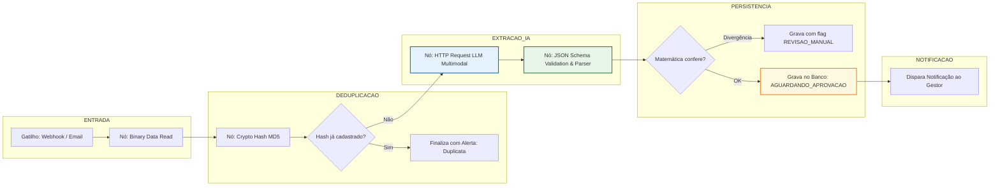

# 📄 PRD — Documento de Requisitos de Produto (Product Requirements Document)

**Produto**: ImpactPay AI — Central Inteligente e Integrada de Contas a Pagar  
**Organização**: Holding Companhia de Impacto (Impact Hubs, Salto, Impacta Mais, Seu PêJota)  
**Vaga / Função**: Pessoa Analista Pleno de Inteligência Artificial e Produtos Digitais  
**Candidato**: Moisés Branco dos Santos  
**Versão**: 1.0 (Executiva / Desafio Técnico)  
**Data**: 14/09/2026  
**Status**: Aprovado para Implementação  

---

## 1. Sumário Executivo & Visão do Produto

### 1.1. Visão do Produto
O **ImpactPay AI** é uma solução inteligente, unificada e escalável de automação para o processo de Contas a Pagar da **Companhia de Impacto**. A plataforma transforma uma rotina financeira fragmentada, manual e vulnerável a erros em um ecossistema digital orientado a dados, orquestrado pelo **n8n** e potencializado por **IA Multimodal (LLMs com Structured Outputs)**.

A solução garante **governança centralizada para a holding**, mantendo o isolamento fiscal e a autonomia operacional das 4 verticais de negócio (*Impact Hubs Floripa, São Paulo, POA e Cuiabá*, *Salto*, *Impacta Mais* e *Seu PêJota*).

### 1.2. Declaração de Missão
> *"Garantir que nenhuma nota fiscal se perca, nenhum pagamento seja feito com atraso e que o time financeiro atue com estratégia e análise, substituindo digitação manual repetitiva por fluxos inteligentes com supervisão humana (Human-in-the-Loop)."*

---

## 2. Contexto de Negócio & Oportunidade

### 2.1. Diagnóstico do Cenário Atual (As-Is)
Atualmente, o processo de contas a pagar da holding opera com severas fricções operacionais:
1. **Entrada Descentralizada**: Fornecedores enviam notas para 3 ou mais caixas de e-mail distintas, sem padronização de assunto ou canal.
2. **Esforço Braçal Repetitivo**: Colaboradores baixam PDFs manualmente, abrem documento por documento e transcrevem campos (número da nota, CNPJ, valor bruto, retenções, vencimento, centro de custo) em planilhas.
3. **Comunicação Informal & Falta de Rastreabilidade**: Validações de contratação ocorrem por mensagens soltas no WhatsApp. Não há registro formal de quem autorizou, quando ou por quê.
4. **Impactos Financeiros Diretos**:
   - Vencimentos perdidos resultando em multas e juros por atraso.
   - Desgaste relacional com parceiros e prestadores estratégicos.
   - Falta de visibilidade da diretoria sobre o passivo circulante a vencer em curto prazo.

### 2.2. Cenário Futuro Desejado (To-Be)
Com a implementação do **ImpactPay AI**:
- **Ingestão 100% Centralizada**: E-mails monitorados automaticamente e formulário web unificado com validação imediata.
- **Extração com Inteligência Artificial**: Leitura multimodal de qualquer modelo de NFS-e/NF-e do Brasil, extraindo dados estruturados em JSON em menos de 10 segundos.
- **Validação e Deduplicação Ativa**: Bloqueio de notas duplicadas por assinatura de hash e chave fiscal antes de qualquer lançamento.
- **Alçadas Interativas**: Notificações automáticas aos gestores no Slack, Microsoft Teams ou WhatsApp corporativo com cartões informativos e botões de decisão rápida ("Aprovar" / "Rejeitar").
- **Visibilidade em Tempo Real**: Painel operacional unificado para o time financeiro acompanhar o ciclo de vida de cada documento.

---

## 3. Personas & Mapa de Stakeholders

| Persona | Papel no Ecossistema | Principais Dores | O que Espera da Solução |
|---|---|---|---|
| **Ana (Analista Financeira)** | Operação do Contas a Pagar | Perde horas digitando notas; precisa cobrar gestores no chat; teme multas por atraso. | Extração automática precisa; alerta visual de notas a vencer; fila clara de exceções. |
| **Rodrigo (Gestor de Contratação)** | Aprovador da despesa na vertical | É bombardeado com mensagens sem contexto no WhatsApp; esquece de dar "ok". | Notificação clara, com PDF anexado, valores destacados e aprovação em 1 clique. |
| **Mariana (Diretora de Operações / CFO)** | Liderança e Governança da Holding | Falta de previsibilidade de fluxo de caixa; risco de conformidade e passivos fiscais. | Relatórios consolidados por vertical; auditoria imutável de aprovações; cumprimento de LGPD. |
| **Carlos (Fornecedor PJ / Prestador)** | Emissor da Nota Fiscal | Não sabe se sua nota chegou ou se está agendada; recebe cobrança de retrabalho. | Confirmação automática de recebimento e notificação transparente caso falte alguma informação. |

---

## 4. Escopo do Produto & Priorização MoSCoW

### 4.1. Must Have (Obrigatórios — MVP do Desafio)
- [x] Ingestão via Webhook / Gatilho de E-mail de arquivos PDF/imagens de notas fiscais.
- [x] Extração estruturada de campos vitais via LLM Multimodal utilizando **Strict JSON Schema**.
- [x] Mecanismo de **Deduplicação / Idempotência** (Hash MD5/SHA-256 e tupla `[CNPJ_Emitente + Numero_NF]`).
- [x] Identificação automática da vertical da holding destinatária (`Impact Hub`, `Salto`, `Impacta Mais`, `Seu PêJota`).
- [x] Armazenamento estruturado dos dados extraídos (Google Sheets / Banco de Dados relacional).
- [x] Roteamento de exceções operacionais (arquivos corrompidos, ausência de vencimento legível).

### 4.2. Should Have (Importantes — Fase de Entrega Completa)
- [ ] Envio de cartão interativo de aprovação com botões de ação ("Aprovar" e "Rejeitar com Justificativa").
- [ ] Escalonamento automático de cobrança para gestores com pendências há mais de 48 horas.
- [ ] Envio de e-mail automático ao fornecedor acusando recebimento e status de processamento.
- [ ] Painel Kanban de visualização rápida de status das notas.

### 4.3. Could Have (Desejáveis — Visão de Escala Futura)
- [ ] Integração nativa via API com ERPs contábeis (ContaAzul, Omie, TOTVS).
- [ ] Leitura e validação de certidões negativas de débito (CND) municipais e federais do prestador.
- [ ] Geração automática de arquivo CNAB ou agendamento via Open Finance para autorização bancária.

### 4.4. Won't Have (Fora de Escopo Imediato)
- [ ] Execução autônoma de pagamentos sem aprovação humana final (rejeitado por diretrizes de governança e segurança financeira — *Human-in-the-loop* obrigatório).

---

## 5. Requisitos Funcionais (RF)

### 📥 Ingestão & Entrada
- **RF01 — Recepção Multicanal**: O sistema deve receber notas fiscais através de dois canais:
  1. *E-mail centralizado*: monitoramento de caixa dedicada (ex: `financeiro@impacthub...`).
  2. *Webhook/Formulário de contingência*: upload manual de PDFs por colaboradores ou fornecedores.
- **RF02 — Validação Preliminar de Arquivo**: O sistema deve validar tipo MIME e integridade do arquivo recebido (apenas `.pdf`, `.png`, `.jpg`, `.xml`). Arquivos executáveis ou corrompidos devem ser descartados com log de segurança.
- **RF03 — Verificação de Duplicidade (Idempotência)**: O sistema deve gerar o hash criptográfico do arquivo e verificar na base histórica se a nota já foi processada. Caso a combinação `[CNPJ_Prestador + Numero_NF]` já conste na base, o processamento deve ser interrompido e um alerta de nota duplicada emitido.

### 🧠 Inteligência Artificial & Extração
- **RF04 — Extração Multimodal com Schema Estruturado**: O sistema deve enviar o documento fiscal para o modelo de linguagem multimodal (ex: Gemini Flash / GPT-4o-mini) com instrução estrita de extrair os seguintes campos:
  - `numero_nf` (string)
  - `serie` (string, opcional)
  - `data_emissao` (date YYYY-MM-DD)
  - `data_vencimento` (date YYYY-MM-DD)
  - `empresa_destinataria` (string — Tomador do serviço)
  - `cnpj_destinatario` (string formatada)
  - `prestador.razao_social` (string)
  - `prestador.cnpj_cpf` (string)
  - `prestador.email` (string, se presente)
  - `valores.valor_bruto` (float)
  - `valores.retencoes_impostos` (float — soma de ISS, IRRF, PIS/COFINS/CSLL)
  - `valores.valor_liquido` (float)
  - `servico.descricao_resumida` (string)
  - `servico.centro_custo_inferido` (string)
- **RF05 — Auditoria de Consistência Matemática**: O sistema deve verificar programaticamente se `valor_bruto - retencoes_impostos == valor_liquido` (com tolerância de arredondamento de R$ 0,02). Se houver discrepância, marcar campo `alerta_inconsistencia`.

### 💾 Armazenamento & Gestão de Estado
- **RF06 — Persistência Estruturada**: O sistema deve salvar os dados da nota em repositório centralizado, atribuindo um `id_transacao` único e iniciando com status `AGUARDANDO_APROVACAO`.
- **RF07 — Máquina de Estados Operacional**: As notas fiscais devem transitar exclusivamente pelos seguintes estados:
  ```mermaid
  stateDiagram-v2
      [*] --> RECEBIDA
      RECEBIDA --> EM_PROCESSAMENTO
      EM_PROCESSAMENTO --> ERRO_LEITURA: Falha OCR/LLM
      EM_PROCESSAMENTO --> DUPLICADA: Hash existente
      EM_PROCESSAMENTO --> AGUARDANDO_APROVACAO: Dados Válidos
      AGUARDANDO_APROVACAO --> APROVADA: Gestor autoriza
      AGUARDANDO_APROVACAO --> REJEITADA: Gestor recusa
      AGUARDANDO_APROVACAO --> ESCALONADA: Sem resposta > 48h
      ESCALONADA --> APROVADA
      ESCALONADA --> REJEITADA
      APROVADA --> AGENDADA_PAGAMENTO
      AGENDADA_PAGAMENTO --> PAGA: Baixa no banco
      PAGA --> [*]
  ```

### 🤝 Alçadas & Notificações
- **RF08 — Despacho ao Gestor Responsável**: Com base na vertical e no centro de custo inferido, o sistema deve disparar notificação contendo resumo executivo da despesa e link do PDF para o aprovador correspondente.
- **RF09 — Registro de Decisão Auditável**: Ao receber a resposta do gestor, o sistema deve gravar:
  - Nome e e-mail do aprovador;
  - Carimbo de data/hora UTC;
  - Parecer (`Aprovado` ou `Rejeitado`);
  - Justificativa obrigatória em caso de rejeição.

---

## 6. Requisitos Não-Funcionais (RNF)

| Categoria | ID | Requisito | Critério de Aceite |
|---|---|---|---|
| **Acurácia** | RNF01 | Precisão na extração de campos críticos | Taxa de acerto $\ge 98\%$ para número de NF, CNPJs, data de vencimento e valor líquido. |
| **Performance** | RNF02 | Tempo de resposta de ponta a ponta | Processamento completo (da chegada do arquivo à gravação na base) em $\le 45$ segundos por nota. |
| **Disponibilidade** | RNF03 | Continuidade do serviço | Fluxo operacional $\ge 99,5\%$ uptime, com mecanismo de re-tentativa automática (retry com backoff exponencial) para nós de API. |
| **Segurança & LGPD** | RNF04 | Proteção de dados e conformidade | Criptografia em trânsito (HTTPS / TLS 1.3) e em repouso. Restrição de acesso a dados de pessoas físicas (MEI/RPA) conforme Lei 13.709/2018. |
| **Auditabilidade** | RNF05 | Rastreabilidade e logs | Toda ação, transformação e decisão humana deve gerar log com carimbo de tempo, IP e identificador da sessão. |
| **Escalabilidade** | RNF06 | Volume de transações | Capacidade de absorver picos de fechamento contábil (até 300 notas processadas/hora sem degradação). |

---

## 7. Arquitetura da Solução & Fluxo de Dados

### 7.1. Stack Tecnológica
- **Orquestrador de Fluxos**: **n8n** (Open-source / Cloud) — nós modulares, triggers assíncronos, gerenciamento de credenciais e webhooks.
- **Motor de Inteligência Artificial**: **Google Gemini 1.5 Flash / OpenAI GPT-4o-mini** via API — alta performance multimodal, custo reduzido por token e suporte a Structured Outputs nativo.
- **Armazenamento de Dados**: **Google Sheets API / Airtable / PostgreSQL** — controle relacional de contas a pagar e histórico de aprovação.
- **Canal de Comunicação & Aprovação**: **Slack Webhook / Microsoft Teams / WhatsApp Business API** — cartões interativos de aprovação.
- **Apresentação Executiva**: **Portal Web do Desafio** (hospedado na Vercel / GitHub Pages) com diagrama interativo, visualizador de JSON e documentação.

### 7.2. Pipeline de Dados no n8n (Trecho 1 — Implementação Prática)


---

## 8. Matriz de Riscos & Plano de Contingência ("O Que Fazer Se Quebrar")

| Cenário de Falha / Risco | Impacto | Severidade | Ação Preventiva (Automatizada) | Procedimento de Contingência Manual |
|---|---|---|---|---|
| **NF escaneada borrada ou ilegível** | Erro na extração ou valores nulos | Média | O prompt do LLM retorna `"alerta_inconsistencia": "Documento ilegível"` | O n8n move a nota para a fila `ERRO_LEITURA` e envia e-mail ao remetente solicitando novo envio legível. |
| **Queda momentânea da API do LLM** | Travamento temporário da fila | Alta | O n8n aplica política de **3 tentativas automáticas** com intervalo progressivo (1m, 5m, 15m). | Se persistir, nota entra na fila de espera e o analista recebe notificação com botão "Reprocessar Lote". |
| **Fornecedor envia mesma NF em duplicidade** | Risco de pagamento duplo | Crítica | O hash criptográfico e a checagem `CNPJ + Número` barram imediatamente a nota. | Alerta visual no painel financeiro apontando o ID da nota original previamente processada. |
| **Gestor não responde no prazo de vencimento** | Multa / juros de mora | Alta | Bot dispara lembretes automáticos com 48h e 24h antes do vencimento da fatura. | Escalonamento automático para a liderança imediata da vertical após 48h sem retorno. |
| **Arquivo recebido não é documento fiscal (spam, vírus)** | Poluição de dados / risco de segurança | Média | Validador de extensão e verificação semântica do LLM descartam o arquivo se não for NFS-e/NF-e. | O arquivo é isolado, sem inserção no banco de pagamentos, e arquivado na pasta de quarentena. |

---

## 9. Métricas de Sucesso do Produto (KPIs & OKRs)

### 🎯 Objetivo Principal (Objective)
Eliminar a ineficiência operacional do contas a pagar e blindar a Companhia de Impacto contra multas e falhas fiscais.

### 📊 Resultados-Chave (Key Results)
1. **KR 1 (Tempo de Ciclo)**: Reduzir o tempo médio de processamento por nota (da recepção até o agendamento bancário) de **72 horas para menos de 4 horas**.
2. **KR 2 (Esforço Manual)**: Reduzir em **90%** as horas gastas pelo time financeiro em digitação manual de notas fiscais.
3. **KR 3 (Zero Multas)**: Atingir **0 ocorrências de multas ou juros** decorrentes de notas fiscais extraviadas ou atrasadas no fluxo de aprovação.
4. **KR 4 (Acurácia da IA)**: Manter a taxa de extração correta direta sem intervenção humana acima de **95%** do volume total.
5. **KR 5 (Satisfação do Usuário - CSAT)**: Alcançar índice de satisfação superior a **9/10** entre os gestores aprovadores e analistas financeiros.

---

## 10. Mapeamento dos 4 Entregáveis Oficiais do Desafio

Este PRD funciona como o alicerce estratégico para a entrega dos 4 marcos exigidos pela banca avaliadora:

| # | Entregável Oficial | Como este PRD dá suporte à entrega |
|---|---|---|
| **1** | **Desenho da Solução Completa** *(Documento de até 2 páginas)* | Fornece a síntese de arquitetura (Seção 7), justificativa técnica (Seção 7.1), matriz de riscos (Seção 8) e governança LGPD (Seção 6). |
| **2** | **Implementação do Trecho 1** *(Workflow n8n + Schema JSON)* | Especifica exatamente o contrato de dados JSON (Seção 5.2) e a lógica de nós de extração, hash e deduplicação a serem montados no n8n. |
| **3** | **Documentação Operacional** *(Manual amigável para o financeiro)* | Traduz os conceitos técnicos na linguagem da Persona Ana (Seção 3) e estrutura a matriz "O que fazer se quebrar" (Seção 8). |
| **4** | **Vídeo Demonstrativo** *(Até 3 minutos)* | Dá o roteiro e a narrativa de produto necessários para demonstrar o valor de negócio, a inteligência da IA e a robustez do sistema. |

---

*Documento homologado para orientar o desenvolvimento técnico e a redação dos entregáveis oficiais do Desafio Técnico.*
